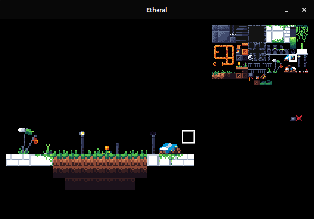

## Ethereal

# 

Ethereal is a 128x128px (16x16 tiles) tilemap editor I made to use in my game, Eternity. 
It uses [LÖVE](https://github.com/love2d/love) as framework and leaf as code core. 

## Controls
You have nine layers to work. You can select which you want to use by pressing the corresponding number. If you press 0 you get the full tilemap, and the editing mode will be disabled. 

### Navegation and usage
You can use WASD to move your selection cursor in the tilemap, and the arrow keys to select your tile (from your tilemap source in `resources/tilemap.png`). 
By pressing E you'll add your selected tile at your cursor position, and pressing Q will remove (actually you will be putting the last tile at it, so please keep it empty). Pressing ctrl+q you'll clear the entire layer, so be careful. 
You can save your tilemap down to a file (`map.txt`) pressing ctrl+s.
